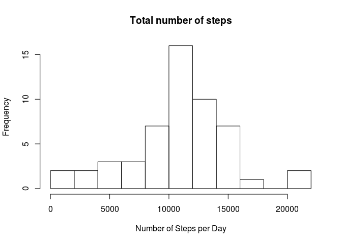
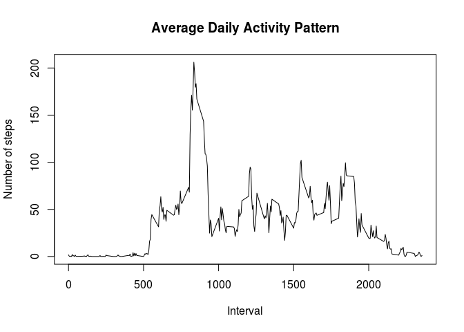
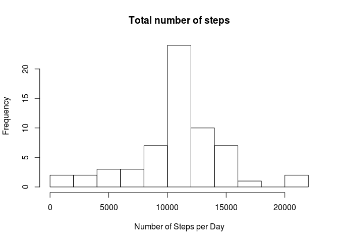
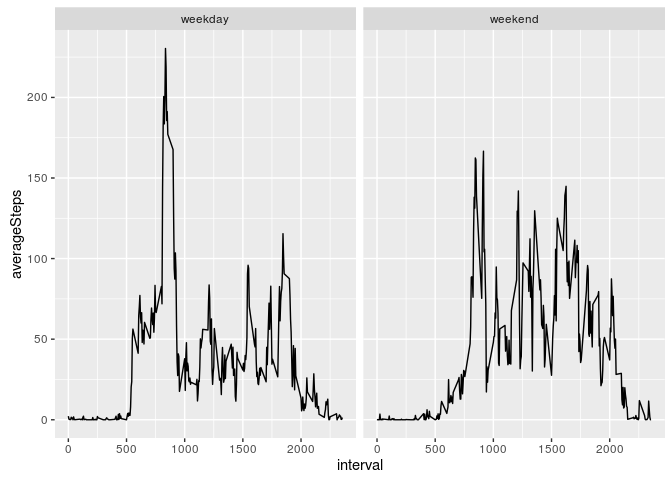

# Reproducible Research: Peer Assessment 1

Loading the libraries.

```r
library(reshape2)
library(ggplot2)
library(dplyr)
```


## Loading and preprocessing the data
Unzipping and loading the data.


```r
unzip("activity.zip")
activity <- read.csv("activity.csv", header = TRUE, nrows = 17570, colClasses = c("numeric","Date", "numeric"))
```

## What is mean total number of steps taken per day?

Reshaping the data set for the total numbers of steps per day.

```r
Melt <- melt(activity, id = "date")
Total <- dcast(Melt, date ~ variable, sum)
```

Plotting the "Total Number of steps" per day.

```r
hist(Total$steps, breaks = 10, main = "Total number of steps", xlab = "Number of Steps per Day")
```

\

Computing the mean number of steps per day (Note that NAs need to be removed; otherwise the mean and median are NA.)

```r
mean(Total$steps, na.rm = TRUE)
```

```
## [1] 10766.19
```

Computing the median number of steps per day.

```r
median(Total$steps, na.rm = TRUE)
```

```
## [1] 10765
```

## What is the average daily activity pattern?

Getting the mean for each interval.

```r
Melt <- melt(activity, id = "interval", na.rm = TRUE)
```

```
## Warning: attributes are not identical across measure variables; they will
## be dropped
```

```r
Interval <- dcast(Melt, interval ~ variable, mean)
```

Creating a plot with the time series of the average number of steps taken versus the 5-minute intervals.

```r
plot(Interval$interval, Interval$steps, type = "l",
     main = "Average Daily Activity Pattern", xlab = "Interval", ylab = "Number of steps")
```

\

Computing the 5-minute interval that, on average, contains the maximum number of steps.

```r
Interval[Interval$steps == max(Interval$steps), 1]
```

```
## [1] 835
```

## Imputing missing values

Computing the number of missing values.

```r
sum(is.na(activity))
```

```
## [1] 2304
```

Replacing the missing values of steps with the mean of the interval.
The result is saved in a new data set.

```r
x <- rep(Interval$steps, 61)
activity2 <- activity
activity2$steps[is.na(activity2$steps)] <- x[is.na(activity2$steps)]
```

Reshaping the data set for the total numbers of steps per day.

```r
Melt2 <- melt(activity2, id = "date")
Total2 <- dcast(Melt2, date ~ variable, sum)
```

Plotting the new histogram.

```r
hist(Total2$steps, breaks = 10, main = "Total number of steps", xlab = "Number of Steps per Day")
```

\

The new mean and median are:

```r
mean(Total2$steps)
```

```
## [1] 10766.19
```

```r
median(Total2$steps)
```

```
## [1] 10766.19
```

## Are there differences in activity patterns between weekdays and weekends?

We found if a day is a *weekday* or a *weekend* and create a new factor variable.

```r
activity2$date <- as.Date(activity2$date)
activity2 <- mutate(activity2, day = weekdays(activity2$date))
activity2$day <- gsub("Monday", "weekday", activity2$day)
activity2$day <- gsub("Tuesday", "weekday", activity2$day)
activity2$day <- gsub("Wednesday", "weekday", activity2$day)
activity2$day <- gsub("Thursday", "weekday", activity2$day)
activity2$day <- gsub("Friday", "weekday", activity2$day)
activity2$day <- gsub("Saturday", "weekend", activity2$day)
activity2$day <- gsub("Sunday", "weekend", activity2$day)
activity2$day <- as.factor(activity2$day)

groupByInt <- group_by(activity2, interval, day)
avgSteps <- summarize(groupByInt, averageSteps = mean(steps))
```

Comparing the average number of steps taken per 5-minute interval across weekdays and weekends.

```r
ggplot(data = avgSteps, aes(x = interval, y = averageSteps)) + geom_line() + facet_grid(. ~ day)
```

\

We can see that *weekday* has the gratest peak but also that *weekends* activities has more peaks over a hundred.
